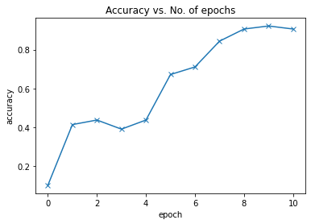
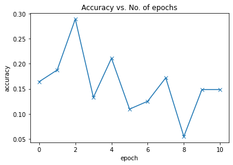

# Dance Form Classification
Indian classical dance is the combination of gesture of all the body parts. It has varied forms and is generally a combination of single hand mudra, double hand mudra, leg alignment, hip movement, eye movement, facial expression, and leg posture. Each dance form has unique gesture, using which, they can be classified. The costumes worn by dancers are also unique. This work proposes the identification and classification of Indian Classical Dance images using Deep Learning Convolution Neural Network (CNN). This work uses the dataset consisting of five dance classes namely Bharatanatyam, Odissi, Kathak, Kathakali, Yakshagana, the images of which are collected from the internet using Google Crawler. This system can be used for automated dance quizzes and can be used by anyone to find out how well he/she is familiar with the variety of dance forms in India given its varied postures and styles.

**In this notebook I will use different architecture given below and measure their effectiveness:**
1. Use feed forword neural network
2. Transfer learning

## Goal
The goal of this project is to classify the images of various dance forms and prepare a Classification model using Deep learning methods.

## Dataset
The dataset which is used in this project, is collected from Kaggle. Here is the link of the dataset : https://www.kaggle.com/souravkgoyal/identify-the-dance-form

## What Have I done
1. Firstly, import all the libraries those are going to use in this project. Check `requirements.txt` in the folder.
2. Importing the dataset using the Kaggle website.
3. Exploring the dataset with respect to different parameters.
4. Data cleaning and pre-processing
5. Deploying the Classification Models.
    - Feed Forward Neural Network
    - Transfer Learning Neural Network
    - Checking the accuracy
6. Model comparison and conclusion.

## Libraries used :
|Tensorflow|OpenCV|Numpy|Pandas|Matplotlib|Keras|Sklearn|Seaborn|fastai2|
|:---:|:---:|:---:|:---:|:---:|:---:|:---:|:---:|:---:|

## Model Accuracy Visualization
A. **Feed Forward Neural Network** :

B. **Transfer Learning Neural Network** :

## Model Comparison
We have deployed two deep learning algorithms and every algorithm is deployed successfully without any hesitation. We have checked the accuracy of the models based on the accuracy score of each of the models. Now let's take a look at the scores of each models.

|Name of the Model|Accuracy Score|
|:---:|:---:|
|Feed Forward Neural Network|17%|
|Transfer Learning Neural Network|91%|

## Conclusion
**Comparing all those scores scored by the deep learning algorithms, it is clear that Transfer Learning Neural Network is having the upper hand in case of this dataset.**

Best Fitted Models ranking -
1. Transfer Learning Neural Network
2. Feed Forward Neural Network

Hooray!! The models are deployed successfully!

********************************************************************
